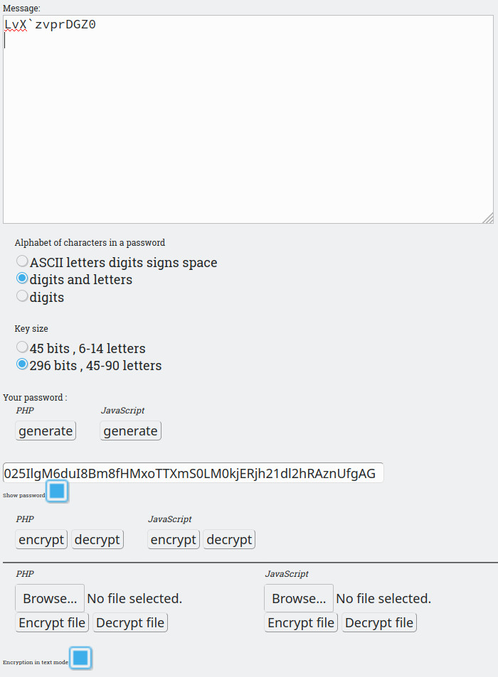

# shifr-php

ENG

Symmetric stream encryption with 'salt'. 
The 'salt' is constantly being produced, which gives good encryption strength. 
Data size doubles in binary mode. 
Will triple in text mode. 
There is no diagnosis of the wrong password. 
The encryption key size is 296 bits ( 45 - 90 letters ). 
Or light key with 45 bits ( 6 - 14 lettters ). 
The PHP <i>(server's side)</i> code compatible with C. 
The JavaScript <i>(user's side)</i> code is also compatible. 
 
Password encrypted × password = can serve as a hash function. 
Hash ÷ decrypt (password) == password  
If the decrypted hash with the password gives this password, then the password is correct. 

Double encryption of known data with a password can serve as a signature.  
For example Sha1Sum(data) × password × password = Signature  
If the signature decrypted twice gives the checksum, then this gives reason to trust the signed data. 

Double data decryption can also serve as a signature. 
Data ÷ decryption ÷ decryption = signature 
The data is decrypted twice and verified with the signature. 

RUS

Симметричное потоковое шифрование с помощью 'соли'. 
'Соль' постоянно вырабатывается, что даёт хорошую стойкость шифрования. 
Размер данных удваивается в двоичном режиме. 
Утроится в текстовом режиме. 
Нет никакого диагноза неправильного пароля. 
Размер ключа шифрования составляет 296 бит ( 45-90 букв ). 
Или лёгкий ключ с 45 битами ( 6 - 14 букв ). 
PHP <i>(серверная часть)</i> кода, совместимый с C. 
Код JavaScript <i>(на стороне пользователя)</i> также совместима. 
 
Пароль зашированный × паролем = может служить как хеш функция. 
Хеш ÷ расшифровать (паролем) == пароль 
Если расшифрованный хеш с паролем даёт тот-же пароль, то пароль правильный. 

Двойное шифрование известных данных паролем может служить подписью. 
Например Sha1Sum(данные) × пароль × пароль = Подпись 
Если подпись расшифрованная два раза даёт контрольную сумму, то это даёт  
повод доверять подписаным данным. 

Двойная расшифровка данных тоже может служить подписью. 
Данные ÷ расшифр ÷ расшифр = подпись 
Данные два раза расшифровываются и сверяются с подписью. 

